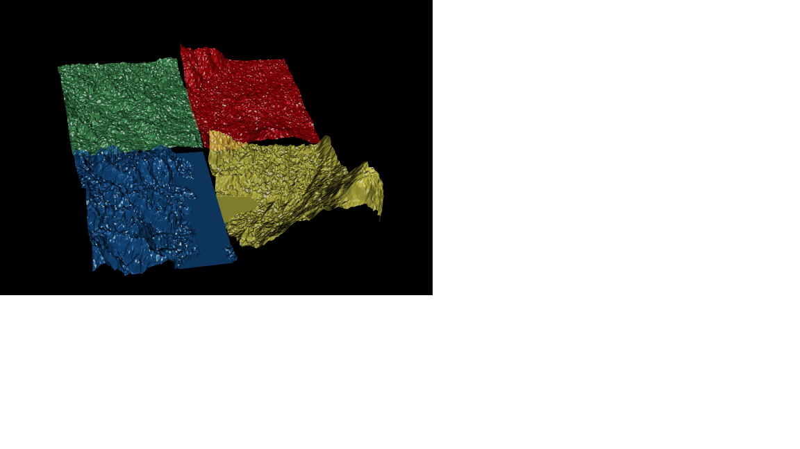

<!-- README.md is generated from README.Rmd. Please edit that file -->

# hillysilly

<!-- badges: start -->
<!-- badges: end -->

The goal of hillysilly is to plot elevation very uselessly for a set of
input addresses or locations.

## Installation

You can install the development version of hillysilly like so:

``` r
remotes::install_github("mdsumner/hillysilly")
```

## TODO

-   remove raster (but update anglr too)
-   cleanup messy code
-   cleanup bad use of rgl window control
-   fix spacing/offset when different tile dimensions or width/height
    are used!
-   provide colour control
-   expand on tile logic (and the matrix of inputs possible)
-   allow other input data, other raster sources
-   etc

## Example

This is a basic example which shows you how to solve a common problem:

``` r
library(hillysilly)
## basic example code
hillysilly(c("Auckland", "Murray Hill",  "Zurich", "Oxford"))
```


